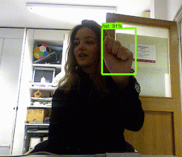

# Gesture Recognition
Roboy wishes to understand gestures. In order to do that Roboy needs to figure out meaning of a gesture.

## About
This repository contains scripts used to train a hand detector using Tensorflow and documents them. The goal of this repository is to detect 10 different gestures that are in [this dataset.](http://lttm.dei.unipd.it/downloads/gesture/#kinect_leap)

Dataset input and its corresponding output side-by-side.

|    Input    |    Output   |
|:-----------:|:-----------:|
|  |  |

You can
* watch 1 minute presentation video of this project from [here.](https://drive.google.com/file/d/1Mz4dRa_b8zSc3BKTFTgVgpiczT_cXwGI/view)
* check project presentation from [here.](https://drive.google.com/open?id=1F4Pl8aalB-aTRqPhwM_kZe3C9DQW97XoO-QHTRtjcds)
* read detailed explanation of this project from [here.](https://devanthro.atlassian.net/wiki/spaces/SS18/pages/280952998/Gesture+Recognition)

## Repository folders
This repository contains three folders.
* old
* run
* train

In **old** folder you will find the very first scripts that we used for training. They do not work for this task.

In **run** folder you will find a script to run trained network. Also, this folder contains model checkpoints and frozen graph.

In **train** folder you will find necessary scripts to train a neural network to detect hand gestures.

You can see detailed explanations in corresponding folders.

# References
Victor Dibia, Real-time Hand-Detection using Neural Networks (SSD) on Tensorflow, (2017), GitHub repository, https://github.com/victordibia/handtracking

Harrison Kinsley, Introduction and Use - Tensorflow Object Detection API Tutorial, (August 2018), https://pythonprogramming.net/training-custom-objects-tensorflow-object-detection-api-tutorial

G. Marin, F. Dominio, P. Zanuttigh, "Hand gesture recognition with Leap Motion and Kinect devices", IEEE International Conference on Image Processing (ICIP), Paris, France, 2014

G. Marin, F. Dominio, P. Zanuttigh, "Hand Gesture Recognition with Jointly Calibrated Leap Motion and Depth Sensor", Multimedia Tools and Applications, 2015